<!-- Animated banner — save banner.svg to this repo and it renders natively on GitHub -->

  

# Kishore Kumar B N
### M.Tech Data Science · SRMIST &nbsp;|&nbsp; Aspiring Data Scientist

 

---

## 👨‍🎓 About Me

🎓 Pursuing **M.Tech in Data Science** at **SRM Institute of Science and Technology (SRMIST)**

📍 India &nbsp;|&nbsp; 
📬 [kishorekumarbn18@gmail.com](mailto:kishorekumarbn18@gmail.com)

🔬 **Currently Researching:**
> *"Comparative and Ensemble-Based Approach for Time-Series Energy Consumption Forecasting Using Machine Learning and LSTM Networks"*

🏆 **Hackathons:** TANFINET Hackathon 2026 &nbsp;|&nbsp; SAP × Great Lakes HackFest 2026

💡 **Interests:** Machine Learning · NLP · Data Analytics · MLOps · GenAI · Time-Series Forecasting

---

## 🏆 Hackathon Projects

> *Built under pressure. Shipped with purpose. Competition-grade AI.*

<table>
  <tr>
    <td width="50%">
      <h3 align="center">⚡ NetFault-AI</h3>
      

        
      

      

        
        
      

      
AI-powered network fault isolation for <strong>BharatNet</strong>. Cuts fault detection from <strong>2–6 hours → under 60 seconds</strong> (99.7% reduction) using distilBERT NLP + Isolation Forest anomaly detection. Real 106-node topology, GIS blast radius mapping, automated ticket routing, and live <strong>Mininet Digital Twin</strong>.

      

        
        
        
      

      
<strong>Stack:</strong> Python · distilBERT · Isolation Forest · Streamlit · NetworkX · Folium · Mininet

      
<em>👥 w/ <a href="https://github.com/ShriHarsan64K">@ShriHarsan64K</a></em>

    </td>
    <td width="50%">
      <h3 align="center">🤖 AgentReady Score</h3>
      

        
      

      

        
        
      

      
The <em>"SEO tool for AI Shopping Agents"</em> — ML-powered diagnostic platform that scores e-commerce APIs for autonomous AI agent compatibility. Random Forest (R²=0.94) trained on 100K real orders, real-time SSE simulation, fraud detection, and ROI action plans with <strong>165× return</strong>.

      

        
        
        
      

      
<strong>Stack:</strong> Python · FastAPI · Random Forest · Isolation Forest · SQLite · Recharts

      
<em>👥 w/ <a href="https://github.com/ShriHarsan64K">@ShriHarsan64K</a> & team</em>

    </td>
  </tr>
</table>

---

## 🚀 Solo Projects

<table>
  <tr>
    <td width="50%">
      <h3 align="center">🛒 Customer Conversion & Clickstream</h3>
      

        
      

      
ML-powered Streamlit app to analyze customer behavior, predict pricing, classify purchases, and segment customers from clickstream data.

      
<strong>Stack:</strong> Python · Scikit-Learn · Streamlit · Pandas

    </td>
    <td width="50%">
      <h3 align="center">📈 Stock Price Prediction — FAANG</h3>
      

        
      

      
Regression-based FAANG stock price prediction with full MLflow experiment tracking, model versioning, and performance logging.

      
<strong>Stack:</strong> Python · MLflow · Regression · Matplotlib

    </td>
  </tr>
  <tr>
    <td width="50%">
      <h3 align="center">📄 Resume Analysis & Skill Assessment</h3>
      

        
      

      
NLP-based resume analyzer with adaptive skill assessment and auto-generated personalized learning roadmaps.

      
<strong>Stack:</strong> Python · NLTK · NLP · Streamlit

    </td>
    <td width="50%">
      <h3 align="center">🚌 RedBus Scraper & Filter App</h3>
      

        
      

      
End-to-end pipeline: scrape bus data from RedBus via Selenium → store in SQL → query interactively through a Streamlit app.

      
<strong>Stack:</strong> Python · Selenium · MySQL · Streamlit

    </td>
  </tr>
  <tr>
    <td width="50%">
      <h3 align="center">📰 Fake News Detection</h3>
      

        
      

      
Naive Bayes NLP classifier to detect fake vs. real news with TF-IDF feature extraction and text preprocessing.

      
<strong>Stack:</strong> Python · Naive Bayes · NLTK · Scikit-Learn

    </td>
    <td width="50%">
      <h3 align="center">🔍 Chicago Crime Analysis</h3>
      

        
      

      
Crime trend analysis with temporal insights, geospatial mapping, and crime type breakdowns — visualized in a Power BI dashboard.

      
<strong>Stack:</strong> Python · Power BI · Pandas · Geospatial

    </td>
  </tr>
</table>

---

## 🛠️ Tech Stack

### 👨‍💻 Languages & ML Libraries

### 📊 Data Visualization & BI

### ⚙️ MLOps & Deployment

---

## 📊 GitHub Activity

---

## 🌱 Currently Learning

- 📉 **Time-Series Forecasting** — LSTM, ARIMA, Prophet, ensemble stacking for energy prediction
- 🤖 **LLMs & GenAI** — LangChain, RAG pipelines, OpenAI & Anthropic APIs
- ☁️ **Cloud ML** — AWS SageMaker & Azure ML
- 🔁 **MLOps** — CI/CD for ML models, experiment tracking, model registry

---

## 📫 Let's Connect

Open to **Data Science roles**, **research collaborations**, and **hackathons**.

---

<!-- Funny bottom note -->
<i>My models are in production. My sleep schedule is not. 🧠☕</i>

 

⭐️ **If you find my work useful, drop a star!** ⭐️

